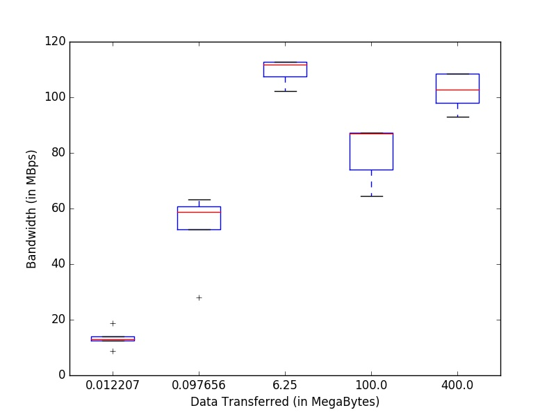

# Parallel Computing Assignment 1

## 1.1 - Observations and Inferences

For the first box, where we're transferring 128 bytes 100 times to the other node, the values are bandwidth is low because for such a small data transfer, the overhead of MPI itself is significant in comparison to sent data. As we increase the amount of data sent, we see a gradual increase upto an extent (when we're sending 65,536 bytes 100 times).

</img>

But then we see a dip when we send a total of 100 Megabytes of data. One of the possible reasons for this dip may be that now we're sending larger chunks of data which need to split into smaller chunks and then combined again on the end of receiving node. This also means that we're increasing the number of packets sent which can imply a higher chance of losing a packet while transfer.

Further, as we increase the amount of data transferred to 400 MB, we see that bandwidth gets stagnated and the only thing which increases is the latency. This is because now each envelope of message contains same amount of data and we're just sending more and more such messages. The bottleneck here comes from network since the cluster is connected by a 1Gbps link and supports at max 125 MBps transfer rates.
