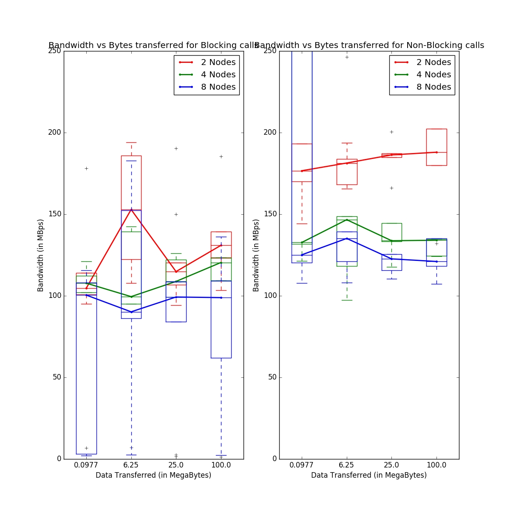

# Parallel Computing Assignment 1

## 1.2 - Observations and Inferences

</img>

Note: One of the reasons the bandwidths are more than the theoretical limit (125 MBps) of the cluster network is taht we're running 4 process per node. Now, 3 of those processes will be running on the same node and these processes will be running on different cores of a processor. The data transfer between these will be at extremely high rates (using some internal shared memory semantics which MPI might be using) since there's no network boundary in this case.

This is the main reason why we see that for 2 nodes, we're getting the maximum bandwidths for both the blocking as well a non-blocking calls. Now, even for 4 nodes, we see that the effects introduced by these processes running on same processor are still quite significant and occasionally we touch the theoretical limit of 125 MBps for bandwidth as well. 

When we look at the data when we run 4 processes on 8 different nodes, we see a much more stable and predictive trend. This is because now the extra bandwidth introduced by those 3 processes isn't significant compared to the other (32 - 3 - 1 = 28) processes running on different nodes (4 per node).

Also, the graphs suggest that the values for blocking send/recv is lesser than non-blocking Isend/Irecv. This is because blocking calls must have a paired up send-recv and then only the other send/recv can carry forward. On the other hand, for Isend/Irecv, the data sending and receving part can purely happen in the background and no call waits for others to finish. Hence, the bandwidth is higher.

